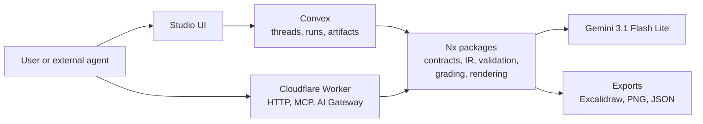
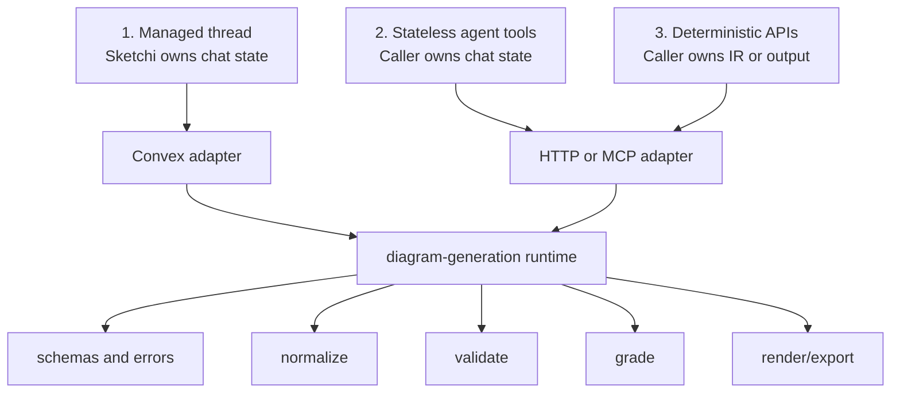
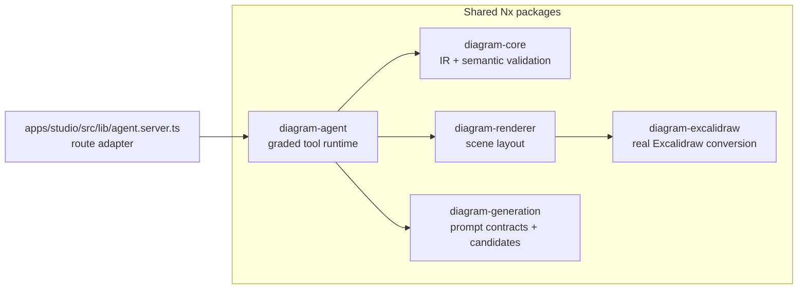
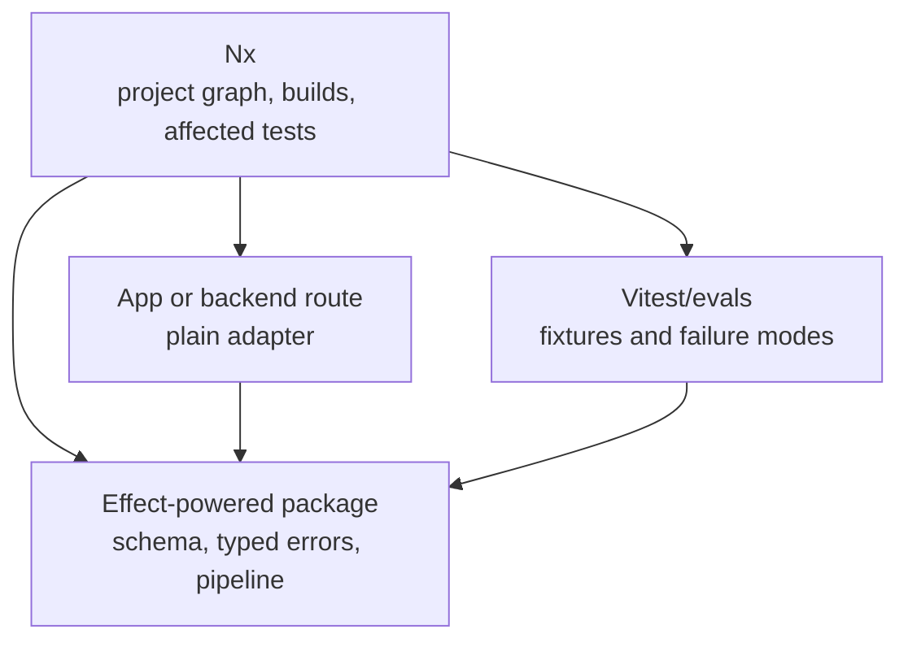
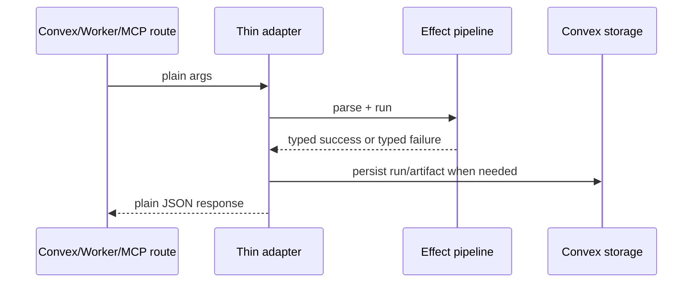
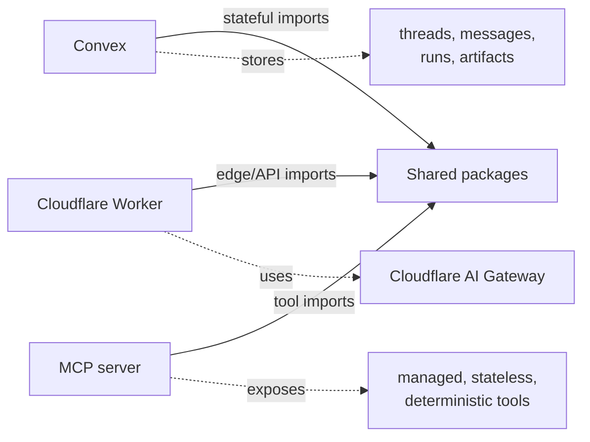
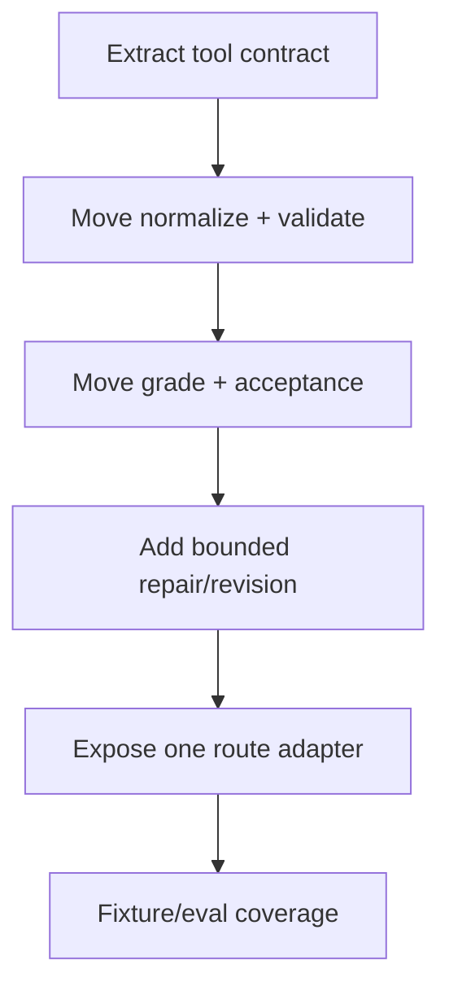

# Agentic Generation

## Decision

Keep **normal Convex** for product state. Put the valuable generation behavior in
shared Nx packages. Use **Effect inside those packages** when it improves
schemas, typed errors, and pipeline tests.

AI SDK stays narrow: chat streaming, model calls, and tool-call transport.
Gemini 3.1 Flash Lite is the only planned model path for now.

## Route Surfaces

| Surface              | Owns                                       | Example calls                                      | Best runtime                         |
| -------------------- | ------------------------------------------ | -------------------------------------------------- | ------------------------------------ |
| Managed thread       | Messages, async progress, artifact history | `createThread`, `continueThread`, `acceptArtifact` | Convex                               |
| Stateless agent tool | One request/response generation task       | `draft_diagram`, `revise_diagram`, `grade_diagram` | Worker, MCP, or Convex action        |
| Deterministic API    | Pure checks and conversions                | `normalize`, `validateIr`, `render`, `export`      | Shared package, wrapped by any route |

## Package Shape

| Package              | Keep here                                                    | Keep out                           |
| -------------------- | ------------------------------------------------------------ | ---------------------------------- |
| `diagram-core`       | IR types, parsing, semantic validation, fixtures             | Model calls, storage               |
| `diagram-renderer`   | Deterministic scene model                                    | Provider logic, user/session state |
| `diagram-excalidraw` | Excalidraw conversion and validation                         | Chat orchestration                 |
| `diagram-generation` | Gemini request/response helpers, prompt messages, candidates | Durable threads                    |
| `diagram-agent`      | Tool contract, normalize, grade, repair, revise, eval replay | App routes, auth, provider menus   |

## Effect + Nx

Effect and Nx do not compete.

| Question                            | Answer                                                                            |
| ----------------------------------- | --------------------------------------------------------------------------------- |
| Does Nx need special Effect config? | No. Effect is just TypeScript inside an Nx package.                               |
| What does Nx add?                   | Boundaries, imports, cacheable targets, affected checks.                          |
| What does Effect add?               | Typed pipelines, typed failures, schema-first parsing, testable retries/timeouts. |
| Where should Effect live first?     | `packages/diagram-generation` or the planned `packages/diagram-agent`.            |
| Where should it not leak yet?       | React UI, Convex schema, or Cloudflare route handlers unless that buys clarity.   |

Preferred shape:

## Runtime Ownership

| Runtime | Good at                                                 | Should not become                      |
| ------- | ------------------------------------------------------- | -------------------------------------- |
| Convex  | Product state, auth, threads, artifacts, async progress | The only way to run generation         |
| Worker  | Public HTTP, MCP, AI Gateway, independent deploys       | The source of truth for shared logic   |
| MCP     | Agent-facing tools                                      | A parallel implementation              |
| AI SDK  | Model calls, streaming, tool-call plumbing              | Artifact contract or provider strategy |

## Next Slice

The next implementation slice should be MCP-first and non-Convex. See
[MCP-First Generation Scope](mcp-first-generation.md) for the concrete steps.

Acceptance criteria:

- `agent.server.ts` becomes a route adapter, not the generation runtime.
- Tool schema, normalization, grading, and repair are importable from a package.
- Studio still streams a real Gemini 3.1 Flash Lite generation.
- Tests cover malformed tool args, invalid edges, weak branching, accepted IR,
  and revision against prior accepted context.
- No OpenRouter path, provider menu, or generalized model router.

## References

- Convex Agent overview: https://docs.convex.dev/agents/overview
- Convex Agent streaming: https://docs.convex.dev/agents/streaming
- Cloudflare AI Gateway Worker binding methods:
  https://developers.cloudflare.com/changelog/post/2025-01-26-worker-binding-methods/
