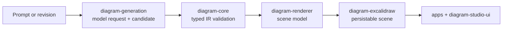
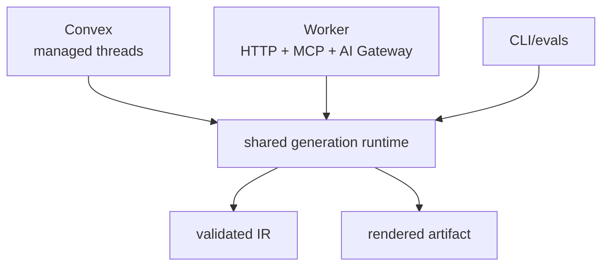
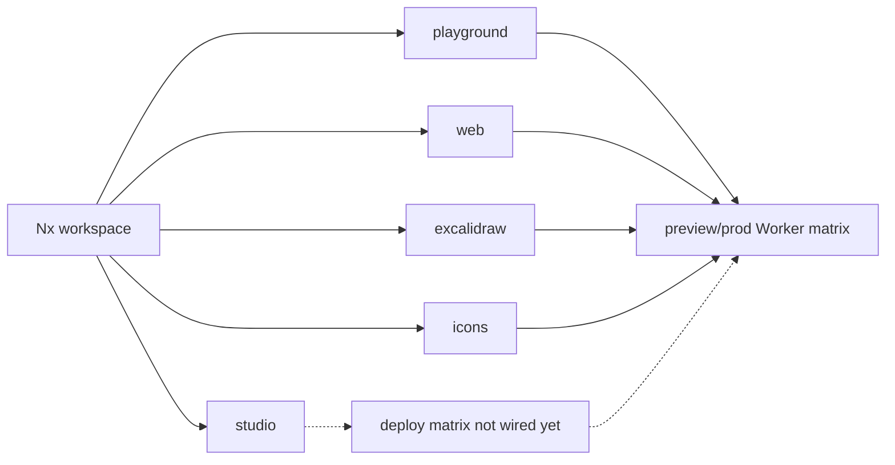

# Sketchi v2 Architecture

Sketchi v2 should make diagram generation boring in the best way: inputs are validated, rendering is deterministic, and UI states are exercised outside the app shell.

## At A Glance

| Area                | Source of truth                                     | Proof                            |
| ------------------- | --------------------------------------------------- | -------------------------------- |
| Diagram contract    | `packages/diagram-core`                             | core tests and fixtures          |
| Deterministic scene | `packages/diagram-renderer`                         | renderer tests and stories       |
| Excalidraw output   | `packages/diagram-excalidraw`                       | real-scene validation            |
| Agentic generation  | `packages/diagram-generation`, then `diagram-agent` | fixture/eval tests               |
| Product surfaces    | `apps/*`                                            | Nx app builds and Worker deploys |



## Package Boundaries

- `diagram-core` owns the intermediate representation, semantic validation, and reusable fixtures.
- `diagram-renderer` converts validated diagrams into a deterministic scene model.
- `diagram-excalidraw` converts deterministic scenes into persisted Excalidraw elements and validates real-scene invariants.
- `diagram-scenarios` owns maintained prompts, assertions, fixture evaluation, and local command-provider runs.
- `diagram-generation` owns provider request/response mapping and candidate parsing.
- `diagram-studio-ui` renders the scene model and owns user-facing component states.
- `apps/playground` composes the packages in a TanStack Start testing ground.
- `apps/studio` owns the current agentic generation spike and should become a
  thin product adapter over shared generation packages.
- `apps/web` owns the public home/docs surface and should stay free of diagram runtime dependencies unless docs become interactive.
- `apps/excalidraw` owns the no-auth product shell for `excalidraw.sketchi.app` and composes the diagram packages into a real workspace.
- `apps/icons` owns `icons.sketchi.app` and serves the copied pre-cleaned `sketchi-icons/output` tree from its app-local public assets.

See [Agentic Generation](agentic-generation.md) for the intended Convex,
Cloudflare Worker, MCP, AI SDK, Effect, and Nx boundaries.

## Diagram Pipeline

1. The remote thread planner chooses a generated tool such as `generateDiagram`, `restructureDiagram`, or `tweakDiagram`.
2. Generation produces or edits a typed intermediate diagram. The first hard target is the `flowchart` contract.
3. `diagram-core` validates shape, references, and diagram-type invariants.
4. `diagram-renderer` converts the diagram into deterministic scene primitives.
5. `diagram-excalidraw` converts the scene into Excalidraw elements and validates real output constraints such as arrow bindings and bound text fit.
6. `diagram-scenarios` runs maintained assertions against fixture or one-shot model output.
7. UI packages display those primitives in a real Excalidraw canvas and expose stateful review workflows.

This makes defects local: invalid references fail in core tests, scene drift fails in renderer tests, Excalidraw syntax issues fail before persistence, visual UI states fail in Storybook/component tests, and app routing/deploy failures stay in the app boundary.

## Flowchart First

The first high-reliability path is decision-heavy flowchart generation. The LLM should produce typed flowchart IR: start/process/decision/end nodes, labeled decision branches, and explicit edges. Code owns layout, real Excalidraw conversion, arrow bindings, and text wrapping. The canonical evaluation fixture is the pharma batch disposition flow.

## Agentic Generation

The durable behavior is the generation runtime, not one chat surface. Keep the
runtime importable by Convex actions, Cloudflare Workers, MCP routes, app routes,
and local evals.



AI SDK remains a thin adapter for model invocation, streaming, and tool-call
plumbing. Effect can live inside the shared generation packages for schemas,
typed errors, and pipeline composition. Nx still owns the project graph, builds,
and affected checks.

## Playground

The playground is not the product app and does not include the Convex remote
agent loop. It is an independently deployable testing ground for maintained
scenarios, pasted model output, and deterministic IR-to-Excalidraw conversion.
The intended public shape is `playground.sketchi.app` once preview deployment is
worth keeping on.

The portable CLI path is:

```sh
pnpm nx scenario diagram-scenarios -- --scenario pharma-batch-disposition --fixture --out .memory/pharma-batch.excalidraw
```

For one-shot model runs through Nx, pass a local command in
`SKETCHI_GENERATOR_COMMAND`. The command reads the scenario prompt from stdin and
writes candidate IR JSON to stdout:

```sh
SKETCHI_GENERATOR_COMMAND="your-llm-command" pnpm nx scenario diagram-scenarios -- --scenario pharma-batch-disposition
```

The CLI also supports direct `--generator-command` usage when it is invoked
outside Nx; put that flag last because the scenario CLI treats the rest of the
argv as the provider command.

This keeps local/OpenCode-style integrations separate from Convex auth, thread
orchestration, and persistence.

## App Surfaces

The v2 workspace has five TanStack Start app surfaces:

- `playground`: scenario evaluation and prompt-output inspection.
- `studio`: hosted agentic generation and diagram artifact review.
- `web`: public home/docs for the Sketchi product direction.
- `excalidraw`: the no-auth diagram workspace that will become the authenticated app later.
- `icons`: a standalone browser for the curated Sketchi icon outputs.



Keep app-specific UI in the app that owns it. Generate those components with
`@sketchi/generators:ui-component --projectRoot=apps/<app>` so stories and tests
stay close to the route shell without adding shared package dependencies.

## Generator Contract

New UI components should be created with `@sketchi/generators:ui-component`.
The generator expands EJS templates into a component folder with implementation,
Vitest coverage, Storybook story, barrel export, and package export wiring.

New diagram types should be created with `@sketchi/generators:diagram-type`.
The generator updates the core diagram type registry and expands EJS templates
for a typed fixture, core contract test, renderer contract test, and Storybook
story. This keeps each diagram type previewable and testable before it is
connected to generation.

The registry is guarded by tests: every registered diagram type must have core,
renderer, and Storybook coverage, and every reusable Studio component must have
an implementation, test, story, local export, and package export.

## Deployment Direction

Each app is scaffolded for Cloudflare Workers through Vite and Wrangler. The
production domain direction is:

- `playground.sketchi.app`
- `studio.sketchi.app`
- `sketchi.app` and `www.sketchi.app`
- `excalidraw.sketchi.app`
- `icons.sketchi.app`

Preview deploys strip production routes and deploy app-specific Workers named
`sketchi-<app>-pr-<number>`.

Today the workflow matrix and deploy helper maps cover `playground`, `web`,
`studio`, `web`, `excalidraw`, and `icons`, with custom domain attachment kept
as an explicit manual workflow dispatch.

## AI Gateway Observability

The live playground uses the Cloudflare AI Gateway Worker binding with
`collectLog: true` and scenario metadata on each request. Cloudflare stores
Gateway logs and can retain request/response payloads for prompt tuning when
the gateway is configured to keep payloads.

Inspect and summarize logs through the Cloudflare API MCP instead of keeping
repo-local Cloudflare API scripts. Configure Codex or another MCP client with
Cloudflare's Code Mode server:

```json
{
  "mcpServers": {
    "cloudflare-api": {
      "url": "https://mcp.cloudflare.com/mcp"
    }
  }
}
```

Use the repo-local `$sketchi-log-analysis` skill in
[.agents/skills/sketchi-log-analysis/SKILL.md](../.agents/skills/sketchi-log-analysis/SKILL.md)
for reusable analysis. The skill keeps the operational behavior read-only, asks
for payload inspection only when retained by the Gateway, and turns model
failures into scenario or prompt-tuning follow-up.
