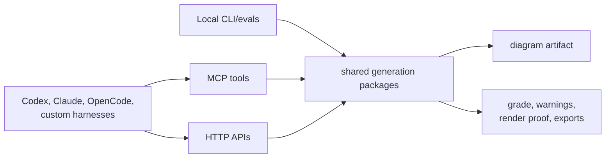
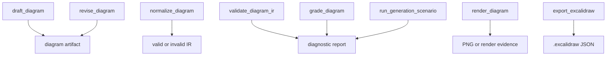
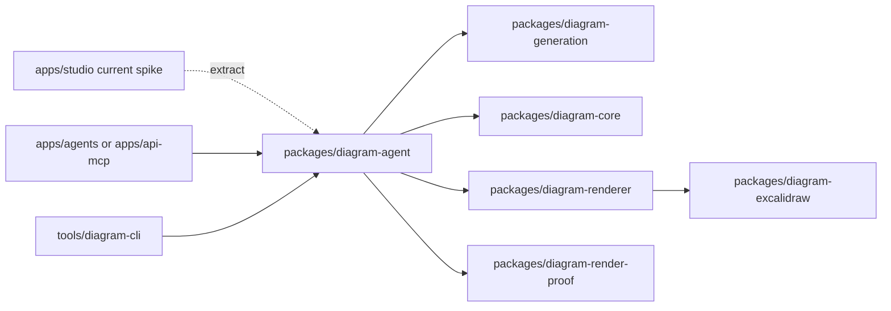
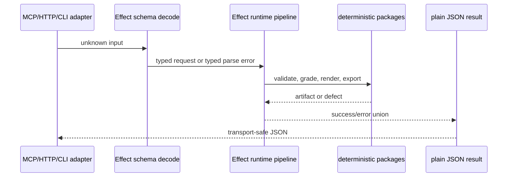
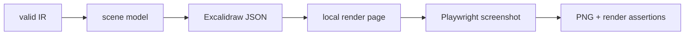
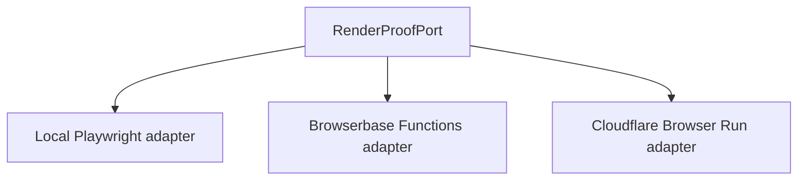
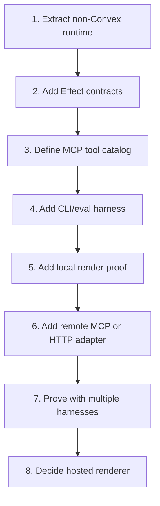

# MCP-First Generation Scope

## Decision

Do every useful generation capability that does **not** require Sketchi-owned
threads, durable runs, user accounts, or Convex storage.

The product bet is that most early usage comes through MCP and external agent
harnesses. The repo should therefore make generation valuable before the normal
managed UI exists.

## In Scope

| Capability                  | User value                                             | Convex dependency |
| --------------------------- | ------------------------------------------------------ | ----------------- |
| Draft a diagram from intent | Get a usable first artifact from messy input           | None              |
| Revise a supplied diagram   | Caller keeps state, Sketchi applies a requested change | None              |
| Normalize model/tool output | Recover useful IR from imperfect model output          | None              |
| Validate IR                 | Explain structural defects before rendering            | None              |
| Grade artifact quality      | Tell agents whether the result is strong enough        | None              |
| Render proof                | Produce visual evidence for tests and agents           | None              |
| Export Excalidraw           | Give callers a real portable artifact                  | None              |
| Run scenarios               | Regression/demo suite for generation quality           | None              |
| Serve MCP tools             | Let many agent harnesses call the same capabilities    | None              |

## Out Of Scope

| Defer                          | Why                                             |
| ------------------------------ | ----------------------------------------------- |
| Managed threads                | Requires Convex messages/runs/artifact history  |
| User-owned artifact library    | Requires auth, persistence, and product records |
| Studio version history         | Requires durable lineage                        |
| Account/team/rate-limit policy | Requires product state                          |
| Confect/Convex refactor        | Useful later, not needed for MCP-first value    |

## Target Tool Surface

These are product tools, not internal function names.

| Tool                      | Input                             | Output                                                   |
| ------------------------- | --------------------------------- | -------------------------------------------------------- |
| `draft_diagram`           | prompt, optional scenario/profile | candidate IR, diagnostics, grade                         |
| `revise_diagram`          | existing IR, revision request     | revised IR, diagnostics, grade                           |
| `normalize_diagram`       | raw model/tool output             | normalized IR or structured errors                       |
| `validate_diagram_ir`     | IR                                | validation result, defects, suggested repair hints       |
| `grade_diagram`           | IR or rendered scene              | acceptance result, rubric scores, warnings               |
| `render_diagram`          | IR or scene                       | render evidence, optional PNG when renderer is available |
| `export_excalidraw`       | valid IR or scene                 | Excalidraw JSON                                          |
| `run_generation_scenario` | scenario id, mode                 | scenario result and artifact evidence                    |

Do not add thread tools yet:

- no `create_thread`;
- no `continue_thread`;
- no `list_user_artifacts`;
- no `accept_artifact`;
- no `get_run_status`.

## Package Plan

| Package/app                     | Responsibility                                                    |
| ------------------------------- | ----------------------------------------------------------------- |
| `diagram-agent`                 | draft/revise orchestration, grading, repair policy, Effect errors |
| `diagram-generation`            | Gemini request/response and candidate parsing                     |
| `diagram-core`                  | IR schema, parse, semantic validation                             |
| `diagram-renderer`              | deterministic scene generation                                    |
| `diagram-excalidraw`            | Excalidraw conversion/export validation                           |
| `diagram-render-proof`          | browser-backed visual proof adapter                               |
| `apps/api-mcp` or `apps/agents` | remote MCP/HTTP adapters over the package runtime                 |
| `tools/diagram-cli`             | local commands for evals and non-hosted tests                     |

## Effect Refactor

Use Effect where it improves the actual generation runtime. Do not spread it
through every package for aesthetics.

| Step                                                     | Scope                                                       |
| -------------------------------------------------------- | ----------------------------------------------------------- |
| 1. Add Effect to the generation package layer            | Keep Zod at route boundaries until replacement earns itself |
| 2. Define typed request/result/error contracts           | Same contracts feed MCP, HTTP, CLI, tests                   |
| 3. Convert model output parsing into Effect decode paths | Bad model output becomes structured recoverable failure     |
| 4. Encode grading and repair as typed results            | Agents can decide whether to retry, revise, or accept       |
| 5. Add adapters back to plain JSON/Zod when needed       | MCP clients should not need to understand Effect            |

Do not use Effect for React state, Convex schemas, or route handler plumbing in
this slice.

## Rendering Plan

We need two separate rendering concepts:

| Need                               | First answer                  | Later answer                                    |
| ---------------------------------- | ----------------------------- | ----------------------------------------------- |
| Deterministic diagram layout       | existing `diagram-renderer`   | same                                            |
| Excalidraw export                  | existing `diagram-excalidraw` | same                                            |
| Visual proof for tests/agents      | local Playwright utility      | serverless browser adapter                      |
| Production PNG/PDF-style rendering | defer                         | Cloudflare Browser Run or Browserbase Functions |

Start local:

Why local first:

- the repo already has Playwright;
- it unblocks grading/eval proof immediately;
- it avoids choosing hosted browser infrastructure too early;
- it gives Browserbase/Cloudflare adapters a precise compatibility target.

Then add a hosted render port:

### Hosted Candidates

| Option                 | Good for                                                                      | Watch out                                                        |
| ---------------------- | ----------------------------------------------------------------------------- | ---------------------------------------------------------------- |
| Browserbase Functions  | Playwright-native scripts deployed as API-callable browser functions          | Adds another vendor and provider/runtime constraints to review   |
| Cloudflare Browser Run | Worker-aligned screenshots/PDFs/browser sessions near existing deploy surface | Needs Worker binding/API setup and browser-runtime limits review |
| Local Playwright only  | Fastest proof and deterministic CI/local tests                                | Not a production render service                                  |

Recommendation: implement the local render utility first, then run one small
adapter spike. Prefer Cloudflare Browser Run if the MCP/API surface stays on
Workers. Prefer Browserbase Functions if we want browser rendering isolated from
the Worker and closer to standard Playwright deployment.

## Implementation Steps

### 1. Extract Non-Convex Runtime

Move existing Studio spike behavior into importable package functions:

- draft;
- revise;
- normalize;
- validate;
- grade;
- render/export.

The Studio app can keep calling the package, but it should no longer own the
behavior.

### 2. Add Effect Contracts

Create stable request/result/error contracts around generation operations.

Acceptance:

- bad input returns typed errors;
- malformed model output is recoverable;
- public JSON result shape is documented;
- tests cover success, validation failure, model-output failure, and repairable
  failure.

### 3. Define MCP Tool Catalog

Document tool names, descriptions, input schemas, and output schemas before
writing transport code.

Acceptance:

- tools are discoverable by name;
- descriptions explain when an agent should call each tool;
- no managed thread tools are included;
- MCP, HTTP, and CLI can use the same catalog.

### 4. Add CLI/Eval Harness

Build local commands that exercise the exact same package runtime as MCP will.

Acceptance:

- run one scenario with fixture mode;
- run one scenario with Gemini mode when credentials are present;
- write `.memory/` evidence for artifacts and render screenshots;
- no Convex env required.

### 5. Add Local Render Proof

Create a local Playwright-backed utility that opens a minimal render page and
captures evidence.

Acceptance:

- PNG evidence exists for a valid flowchart;
- assertions catch blank canvas, missing nodes, and obvious text/layout failure;
- this works without a deployed app.

### 6. Add Remote Adapter

Expose the same catalog through a remote MCP or HTTP app, likely Worker-backed.

Acceptance:

- endpoint is independently deployable;
- local package imports are native Nx imports;
- tool calls return the same result shape as CLI;
- no Convex calls or Convex env vars.

### 7. Prove With Multiple Harnesses

The first proof should not be "works in our UI."

Acceptance:

- CLI proof;
- local MCP client proof;
- Codex or Claude MCP proof;
- Worker preview proof if remote adapter is included;
- one scenario matrix proof with generated artifact evidence.

### 8. Decide Hosted Renderer

Only after local render proof is stable, pick a hosted adapter.

Acceptance:

- one Browserbase Functions or Cloudflare Browser Run proof renders the same
  artifact as local Playwright;
- failures are mapped to the same typed render errors;
- the hosted renderer is optional behind a capability flag.

## Proof Matrix

| Proof                             | Required before Convex?     |
| --------------------------------- | --------------------------- |
| `pnpm nx test diagram-agent`      | yes                         |
| `pnpm nx test diagram-generation` | yes                         |
| local CLI scenario fixture        | yes                         |
| local CLI Gemini scenario         | yes when credentials exist  |
| local render screenshot           | yes                         |
| MCP tool listing                  | yes                         |
| MCP draft/revise/grade call       | yes                         |
| remote Worker preview smoke       | yes if adapter is in the PR |
| managed thread smoke              | no                          |
| Studio artifact history           | no                          |

## References

- Agentic generation overview: [docs/agentic-generation.md](agentic-generation.md)
- Cloudflare Browser Run: https://developers.cloudflare.com/browser-run/
- Browserbase Functions:
  https://docs.browserbase.com/platform/runtime/overview
- Effect Schema: https://effect.website/docs/schema/introduction/
- MCP TypeScript SDK: https://ts.sdk.modelcontextprotocol.io/
