# Sketchi Code Mode API Contract

This is the implementation spec for the first Sketchi agent-facing API surface.
It replaces the earlier "MCP tool catalog" framing with a narrower boundary:
Sketchi exposes a small MCP server for external agent harnesses, and the Code
Mode sandbox calls curated host APIs. The host APIs are normal Worker APIs backed
by the shared diagram packages.

The goal is not to make every internal function callable. The goal is to let
Claude Code, Codex, OpenCode, and similar harnesses build a correct flowchart
artifact through one clear contract, get structured repair feedback when they
are wrong, and retrieve the finished artifact.

## TODO

- [x] Define shared contract types for `buildFlowchart`, `getArtifact`, and
      `applyDiagramPatch`.
- [x] Implement the `buildFlowchart` pipeline for semantic flow and connectivity.
- [x] Store accepted scene and Excalidraw artifacts through one consistent
      artifact manifest.
- [x] Implement `getArtifact` for format-specific retrieval and refreshed
      artifact access.
- [x] Implement `applyDiagramPatch` for deterministic style, shape, text, and
      layout codemods against accepted artifacts.
- [ ] Add MCP `docs` and `search` entries that teach the connectivity-first,
      styling-second agent loop.
- [ ] Add `execute` examples that build the graph first and patch visual
      requests after acceptance.
- [ ] Pressure-test the contract through Codex, Claude Code, and OpenCode.

## Decisions

- Use Code Mode for agent orchestration.
- Do not model the diagram runtime as a set of granular MCP tools.
- Do not expose `validate`, `grade`, `render`, or `export` as public operations.
- Use normal host APIs as the source of truth for request and response shapes.
- Register curated Code Mode functions over those host APIs.
- Start with `buildFlowchart` and `getArtifact`.
- Define `applyDiagramPatch` up front as the first deterministic mutation
  operation for styling, shape, text, and layout changes.
- Agents must get the semantic flow and connectivity accepted before applying
  styling or shape codemods.
- Keep `draft` and managed threads out of this slice.
- Keep Effect, storage, auth, rendering, and model credentials host-side.

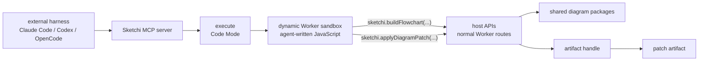

## Boundary

Sketchi has three layers. Only the top layer is MCP. The middle layer is Code
Mode. The bottom layer is the product API/runtime.

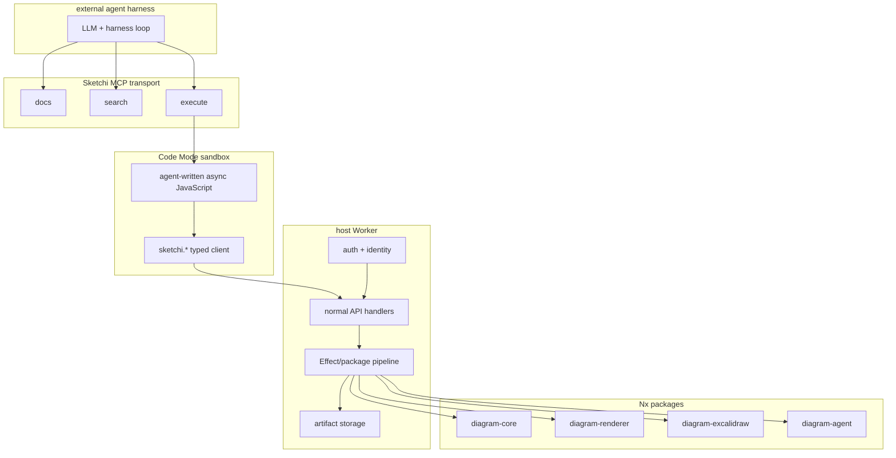

The sandbox is not trusted with secrets, tokens, storage bindings, model
credentials, or direct network access. It receives typed functions only.

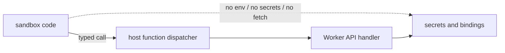

## Public MCP Surface

The external MCP server should stay small. The names below are MCP tools from
the harness point of view, not diagram runtime functions.

| MCP tool  | Purpose                                                           | Calls diagram runtime? |
| --------- | ----------------------------------------------------------------- | ---------------------- |
| `docs`    | Return the curated API contract, examples, and current non-goals. | No                     |
| `search`  | Search operation docs, issue codes, examples, and schema notes.   | No                     |
| `execute` | Run Code Mode JavaScript with the `sketchi.*` client injected.    | Yes                    |

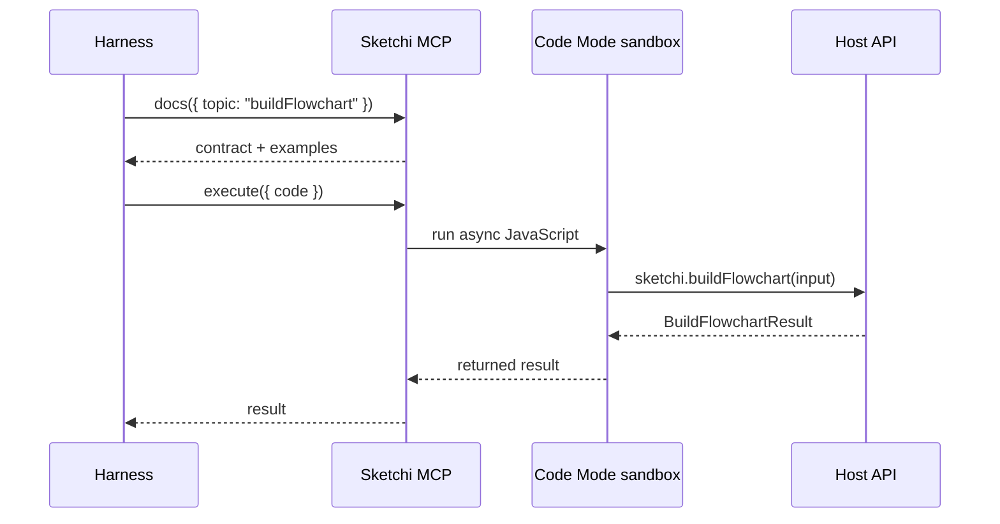

### `docs`

```ts
interface DocsRequest {
  topic?:
    | "overview"
    | "execute"
    | "buildFlowchart"
    | "getArtifact"
    | "applyDiagramPatch"
    | "agentSequence"
    | "issues"
    | "examples";
}

interface DocsResult {
  topic: string;
  content: string;
  examples: CodeExample[];
  version: string;
}

interface CodeExample {
  title: string;
  language: "ts" | "js" | "json";
  code: string;
}
```

### `search`

```ts
interface SearchRequest {
  query: string;
  limit?: number;
}

interface SearchResult {
  query: string;
  results: SearchHit[];
}

interface SearchHit {
  id: string;
  kind: "operation" | "schema" | "issue" | "example" | "non_goal";
  title: string;
  snippet: string;
  score: number;
}
```

### `execute`

The `execute` tool runs an async JavaScript arrow function in Code Mode. The
tool description must include the current `sketchi.*` TypeScript declarations
and one flowchart repair-loop example.

```ts
interface ExecuteRequest {
  code: string;
}

type ExecuteResult =
  | {
      ok: true;
      result: unknown;
      logs: string[];
    }
  | {
      ok: false;
      error: string;
      logs: string[];
    };
```

Inside `execute`, the sandbox receives this namespace:

```ts
declare const sketchi: {
  buildFlowchart(input: BuildFlowchartRequest): Promise<BuildFlowchartResult>;
  getArtifact(input: GetArtifactRequest): Promise<GetArtifactResult>;
  applyDiagramPatch(
    input: ApplyDiagramPatchRequest,
  ): Promise<ApplyDiagramPatchResult>;
};
```

The sandbox must not receive low-level API keys, tokens, bindings, or raw
storage handles.

## Host API Surface

These are normal host API operations. Code Mode functions call them through the
host dispatcher. A future HTTP adapter can expose the same contracts directly.

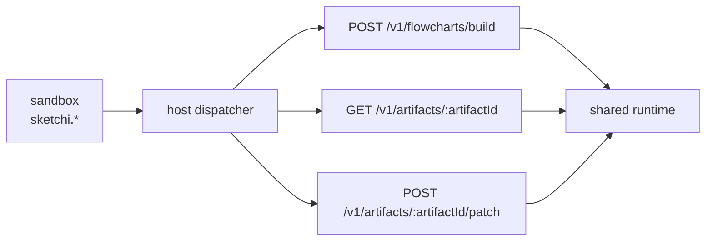

| Host operation                         | Code Mode function                 | Public now?           |
| -------------------------------------- | ---------------------------------- | --------------------- |
| `POST /v1/flowcharts/build`            | `sketchi.buildFlowchart(input)`    | Yes                   |
| `GET /v1/artifacts/:artifactId`        | `sketchi.getArtifact(input)`       | Yes                   |
| `POST /v1/artifacts/:artifactId/patch` | `sketchi.applyDiagramPatch(input)` | Yes                   |
| validate IR                            | none                               | No, internal to build |
| grade quality                          | none                               | No, internal to build |
| render scene                           | none                               | No, internal to build |
| export Excalidraw                      | none                               | No, internal to build |
| draft from prompt                      | none                               | No, later             |
| managed thread                         | none                               | No, later             |

## Agent Sequencing

Agents should handle user requests in two phases:

1. Build and repair the semantic graph.
2. Patch visual styling, shape, text, or layout details against the accepted
   artifact.

This matters even when the human request mixes structure and style in one
sentence, such as "I want a circle connected to a decision diamond that is
purple." The first call should still produce a valid flowchart with correct
nodes and edges. Only after `buildFlowchart` returns `ok: true` should the agent
use `applyDiagramPatch` to set the circle shape, diamond shape, color, or
positioning.

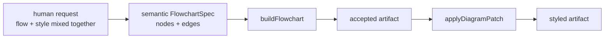

Do not ask the model to directly edit native Excalidraw JSON for common style
or shape changes. Native Excalidraw is intentionally treated as a noisy export
format. Agents should prefer compact Sketchi specs, deterministic scene
artifacts, and structured patch operations.

## `buildFlowchart`

`buildFlowchart` is the first real product operation. It accepts a creation
friendly flowchart spec, validates it, grades it, renders it, exports it to
Excalidraw, stores requested artifacts, and returns either an accepted artifact
or structured repair feedback.

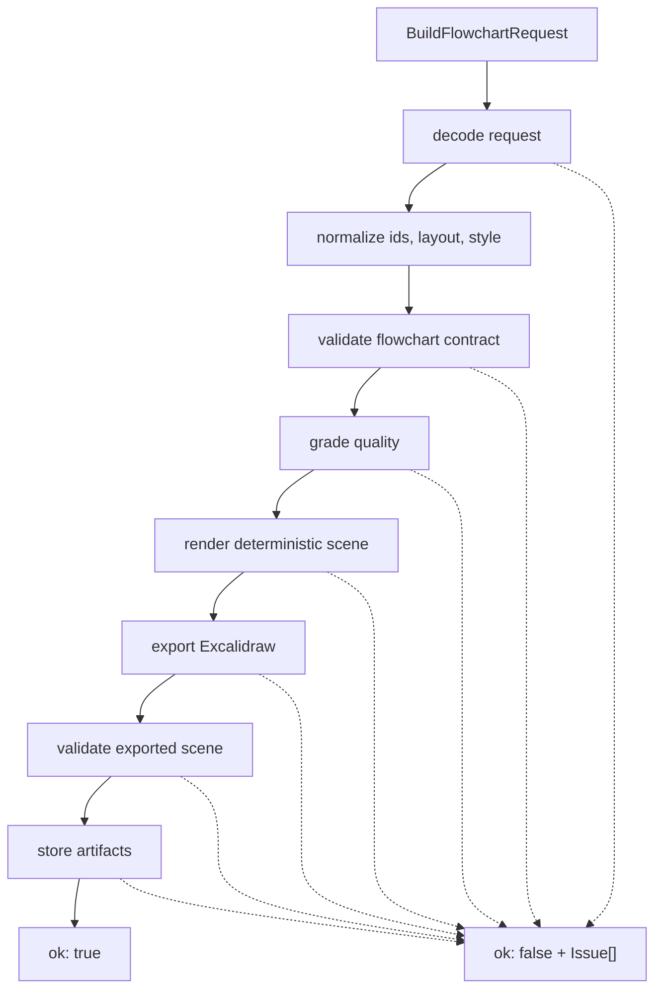

### Request

```ts
interface BuildFlowchartRequest {
  requestId?: string;
  spec: FlowchartSpec;
  options?: BuildFlowchartOptions;
}

interface BuildFlowchartOptions {
  artifactFormats?: ArtifactFormat[];
  inlineArtifacts?: InlineArtifactFormat[];
  minQualityScore?: number;
}

type ArtifactFormat = "excalidraw" | "scene" | "png";
type InlineArtifactFormat = "excalidraw" | "scene";
```

Defaults:

```json
{
  "artifactFormats": ["excalidraw", "scene"],
  "inlineArtifacts": ["scene"],
  "minQualityScore": 8
}
```

### Flowchart Spec

The public input is not the full internal IR. It is the smallest shape agents
need to author correctly.

```ts
interface FlowchartSpec {
  id?: string;
  title: string;
  nodes: FlowchartNode[];
  edges: FlowchartEdge[];
  layout?: FlowchartLayout;
  style?: FlowchartStyle;
}

interface FlowchartNode {
  id: string;
  label: string;
  kind: "start" | "process" | "decision" | "end";
  description?: string;
}

interface FlowchartEdge {
  id?: string;
  source: string;
  target: string;
  label?: string;
}

interface FlowchartLayout {
  direction?: "TB" | "LR";
}

interface FlowchartStyle {
  accentColor?: HexColor;
  backgroundColor?: HexColor;
}

type HexColor = `#${string}`;
```

Default styling is intentionally plain: black stroke, black text, and no
decorative fill unless the caller asks for styling. Agents should not spend
repair attempts on visual polish until graph invariants pass.

### Required Flowchart Invariants

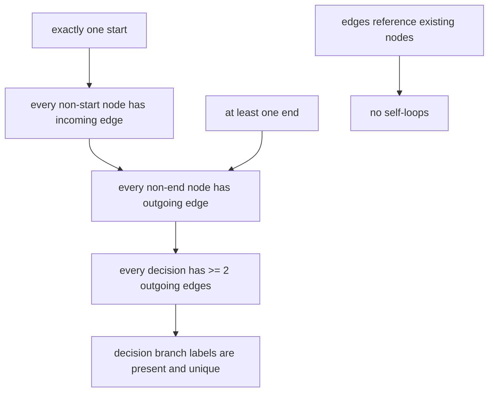

Rules:

- Node ids must be unique.
- Edge ids, when supplied, must be unique.
- Every edge source and target must match a node id.
- Edges cannot connect a node to itself.
- A flowchart must have exactly one `start` node.
- A flowchart must have at least one `end` node.
- The `start` node cannot have incoming edges.
- Every non-start node must be reachable from another node.
- Every `end` node must have zero outgoing edges.
- Every non-end node must have at least one outgoing edge.
- Every `decision` node must have at least two outgoing edges.
- Every outgoing decision branch must have a non-empty label.
- Decision branch labels from the same decision must be unique.

### Result

```ts
type BuildFlowchartResult = BuildFlowchartSuccess | BuildFlowchartFailure;

interface BuildFlowchartSuccess {
  ok: true;
  status: "accepted";
  buildId: string;
  requestId?: string;
  normalizedSpec: NormalizedFlowchartSpec;
  quality: QualityReport;
  artifact: ArtifactBundle;
  issues: Issue[];
}

interface BuildFlowchartFailure {
  ok: false;
  status:
    | "invalid_input"
    | "invalid_flowchart"
    | "quality_failed"
    | "render_failed"
    | "export_failed"
    | "storage_failed";
  buildId?: string;
  requestId?: string;
  normalizedSpec?: NormalizedFlowchartSpec;
  quality?: QualityReport;
  partial?: PartialArtifactBundle;
  issues: Issue[];
}

type NormalizedFlowchartSpec = Required<
  Pick<FlowchartSpec, "id" | "title" | "nodes" | "edges" | "layout" | "style">
>;
```

`issues` is empty when the build is accepted and there are no warnings. Warnings
may still be present on accepted builds.

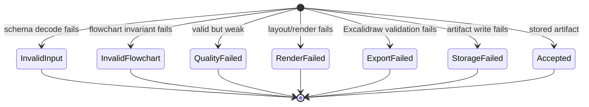

### Quality Report

```ts
interface QualityReport {
  accepted: boolean;
  score: number;
  threshold: number;
  summary: {
    nodeCount: number;
    edgeCount: number;
  };
  checks: QualityCheck[];
}

interface QualityCheck {
  code: string;
  passed: boolean;
  severity: "error" | "warning";
  message: string;
  refs: IssueRef[];
}
```

## Issue Contract

Issues are the main repair interface. They must be stable, machine-readable, and
good enough for an agent to patch its spec without guessing.

```ts
interface Issue {
  code: IssueCode;
  severity: "error" | "warning";
  stage: "input" | "flowchart" | "quality" | "render" | "export" | "storage";
  ref?: IssueRef;
  message: string;
  hint: string;
}

interface IssueRef {
  kind: "request" | "diagram" | "node" | "edge" | "artifact";
  id?: string;
  path?: string;
}
```

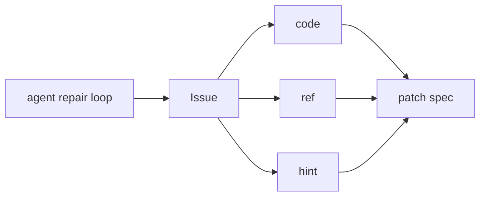

Initial issue codes:

```ts
type IssueCode =
  | "missing_field"
  | "invalid_type"
  | "invalid_enum"
  | "invalid_color"
  | "duplicate_node_id"
  | "duplicate_edge_id"
  | "missing_edge_source"
  | "missing_edge_target"
  | "self_loop"
  | "missing_start"
  | "multiple_starts"
  | "missing_end"
  | "start_has_incoming"
  | "end_has_outgoing"
  | "unreachable_node"
  | "missing_outgoing_edge"
  | "underbranched_decision"
  | "unlabeled_decision_branch"
  | "duplicate_decision_branch_label"
  | "disconnected_graph"
  | "generic_label"
  | "label_too_long"
  | "quality_below_threshold"
  | "render_failed"
  | "text_overflow"
  | "arrow_binding_invalid"
  | "arrow_overlap"
  | "export_invalid_scene"
  | "storage_write_failed"
  | "unsupported_artifact_format"
  | "patch_source_unavailable"
  | "unknown_patch_target"
  | "unsupported_patch_operation"
  | "patch_preserve_connectivity_failed"
  | "patch_output_invalid";
```

Example:

```json
{
  "code": "unlabeled_decision_branch",
  "severity": "error",
  "stage": "flowchart",
  "ref": {
    "kind": "edge",
    "id": "risk-review-to-approve",
    "path": "spec.edges[4].label"
  },
  "message": "Decision node \"risk-review\" has an outgoing branch without a label.",
  "hint": "Add a short branch label such as \"approved\" or \"rejected\"."
}
```

## Artifact Contract

`buildFlowchart` stores artifacts only after the flowchart is accepted and the
requested formats are generated successfully.

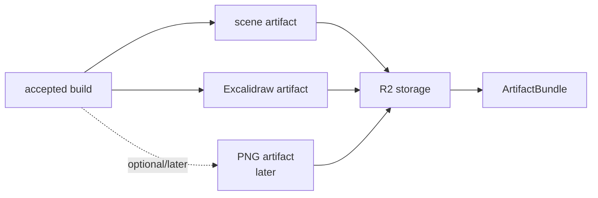

```ts
interface ArtifactBundle {
  artifactId: string;
  diagramId: string;
  formats: ArtifactFormatRef[];
  preview?: ArtifactFormatRef;
}

interface PartialArtifactBundle {
  artifactId?: string;
  diagramId?: string;
  formats?: ArtifactFormatRef[];
}

interface ArtifactFormatRef {
  format: ArtifactFormat;
  mimeType: string;
  url?: string;
  expiresAt?: string;
  inline?: unknown;
  sizeBytes?: number;
}
```

The first implementation should support:

- `scene`: rendered deterministic scene JSON.
- `excalidraw`: portable Excalidraw scene JSON.

The storage contract is consistent across environments: artifacts are written
as a manifest plus one object per format. Local development and tests may use
the in-memory store, but that is only a dev fallback. Worker deployments should
use the same manifest/object layout through an R2-compatible binding.

`png` is allowed in the contract for forward compatibility, but it should not be
advertised as available until the hosted render proof adapter exists.

Native Excalidraw JSON should not be inlined by default. It is large and noisy,
and most agents should not inspect or rewrite it directly. Prefer inline
`scene` data for agent inspection and signed or refreshed artifact access for
native Excalidraw.

## `getArtifact`

`getArtifact` retrieves a stored artifact format by `artifactId`. `diagramId`
is semantic and not unique enough for retrieval.

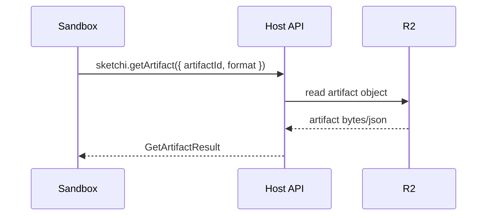

```ts
interface GetArtifactRequest {
  artifactId: string;
  format?: ArtifactFormat;
  inline?: boolean;
}

type GetArtifactResult = GetArtifactSuccess | GetArtifactFailure;

interface GetArtifactSuccess {
  ok: true;
  artifactId: string;
  diagramId: string;
  format: ArtifactFormat;
  mimeType: string;
  url?: string;
  expiresAt?: string;
  inline?: unknown;
  sizeBytes?: number;
}

interface GetArtifactFailure {
  ok: false;
  status:
    | "invalid_input"
    | "not_found"
    | "format_unavailable"
    | "expired"
    | "storage_failed";
  issues: Issue[];
}
```

## `applyDiagramPatch`

`applyDiagramPatch` is the codemod-style operation for deterministic visual
changes after a flowchart artifact has already been accepted. It should handle
common user requests such as changing colors, switching node shapes, shifting a
group, replacing text, or rerouting edges without asking the agent to edit raw
Excalidraw JSON.

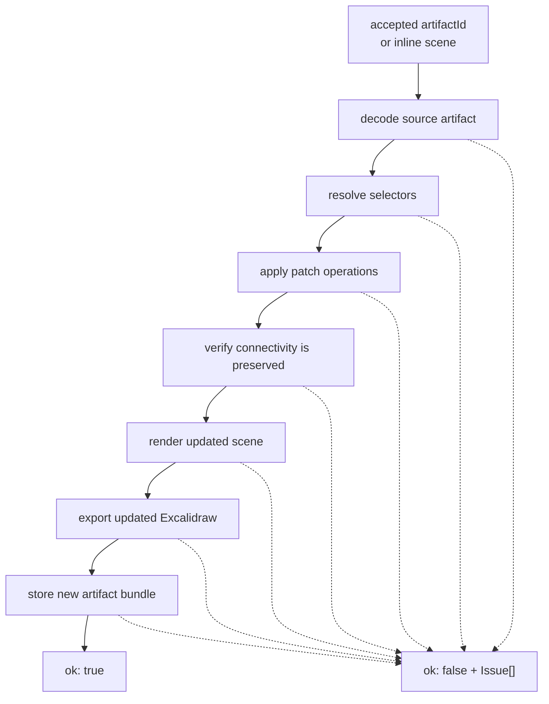

Patch operations must be structured and executable. The optional `intent` field
is only for traceability, docs, and debugging. It must not be the source of
truth for what changes are applied.

```ts
interface ApplyDiagramPatchRequest {
  requestId?: string;
  source: DiagramPatchSource;
  operations: DiagramPatchOperation[];
  options?: ApplyDiagramPatchOptions;
  intent?: string;
}

type DiagramPatchSource =
  | {
      artifactId: string;
      format?: "scene" | "excalidraw";
    }
  | {
      scene: unknown;
    }
  | {
      excalidraw: unknown;
    };

interface ApplyDiagramPatchOptions {
  artifactFormats?: ArtifactFormat[];
  inlineArtifacts?: InlineArtifactFormat[];
  preserveConnectivity?: boolean;
}
```

Defaults:

```json
{
  "artifactFormats": ["excalidraw", "scene"],
  "inlineArtifacts": ["scene"],
  "preserveConnectivity": true
}
```

Initial operation set:

```ts
type DiagramPatchOperation =
  | {
      op: "setDefaultStyle";
      style: DiagramStylePatch;
    }
  | {
      op: "setStyle";
      selector: DiagramSelector;
      style: DiagramStylePatch;
    }
  | {
      op: "setShape";
      selector: DiagramSelector;
      shape: DiagramShape;
    }
  | {
      op: "translate";
      selector: DiagramSelector;
      dx: number;
      dy: number;
    }
  | {
      op: "replaceText";
      selector: DiagramSelector;
      text: string;
    }
  | {
      op: "rerouteEdges";
      selector?: DiagramSelector;
    };

interface DiagramSelector {
  ids?: string[];
  nodeIds?: string[];
  edgeIds?: string[];
  kinds?: FlowchartNode["kind"][];
  labels?: string[];
  scope?: "all" | "nodes" | "edges";
}

interface DiagramStylePatch {
  strokeColor?: HexColor;
  fillColor?: HexColor;
  textColor?: HexColor;
  backgroundColor?: HexColor;
}

type DiagramShape = "rectangle" | "diamond" | "ellipse" | "circle";
```

The first patch operation set is deliberately non-structural. It can restyle,
reshape, move, rename, and reroute existing elements, but it cannot create or
delete nodes or edges. If a user asks to change the graph itself, the agent
should repair the `FlowchartSpec` and call `buildFlowchart` again.

```ts
type ApplyDiagramPatchResult =
  | ApplyDiagramPatchSuccess
  | ApplyDiagramPatchFailure;

interface ApplyDiagramPatchSuccess {
  ok: true;
  status: "accepted";
  patchId: string;
  requestId?: string;
  sourceArtifactId?: string;
  artifact: ArtifactBundle;
  issues: Issue[];
}

interface ApplyDiagramPatchFailure {
  ok: false;
  status:
    | "invalid_input"
    | "source_unavailable"
    | "target_not_found"
    | "unsupported_operation"
    | "connectivity_changed"
    | "render_failed"
    | "export_failed"
    | "storage_failed";
  patchId?: string;
  requestId?: string;
  sourceArtifactId?: string;
  partial?: PartialArtifactBundle;
  issues: Issue[];
}
```

Example:

```js
async () => {
  const built = await sketchi.buildFlowchart({
    spec: {
      title: "Simple approval",
      nodes: [
        { id: "start", label: "Request", kind: "start" },
        { id: "approve", label: "Approved?", kind: "decision" },
        { id: "done", label: "Done", kind: "end" },
        { id: "revise", label: "Revise", kind: "end" },
      ],
      edges: [
        { source: "start", target: "approve" },
        { source: "approve", target: "done", label: "yes" },
        { source: "approve", target: "revise", label: "no" },
      ],
    },
  });

  if (!built.ok) return built;

  return sketchi.applyDiagramPatch({
    source: { artifactId: built.artifact.artifactId },
    intent: "Make the decision diamond purple after the flow is accepted.",
    operations: [
      {
        op: "setStyle",
        selector: { nodeIds: ["approve"] },
        style: { strokeColor: "#7c3aed", fillColor: "#ede9fe" },
      },
      {
        op: "setShape",
        selector: { nodeIds: ["approve"] },
        shape: "diamond",
      },
    ],
  });
};
```

## Expected Agent Loop

The harness should write a spec, call `buildFlowchart`, inspect structured
issues, patch the spec until graph acceptance, and then apply structured visual
patches. Styling is never the first acceptance target.

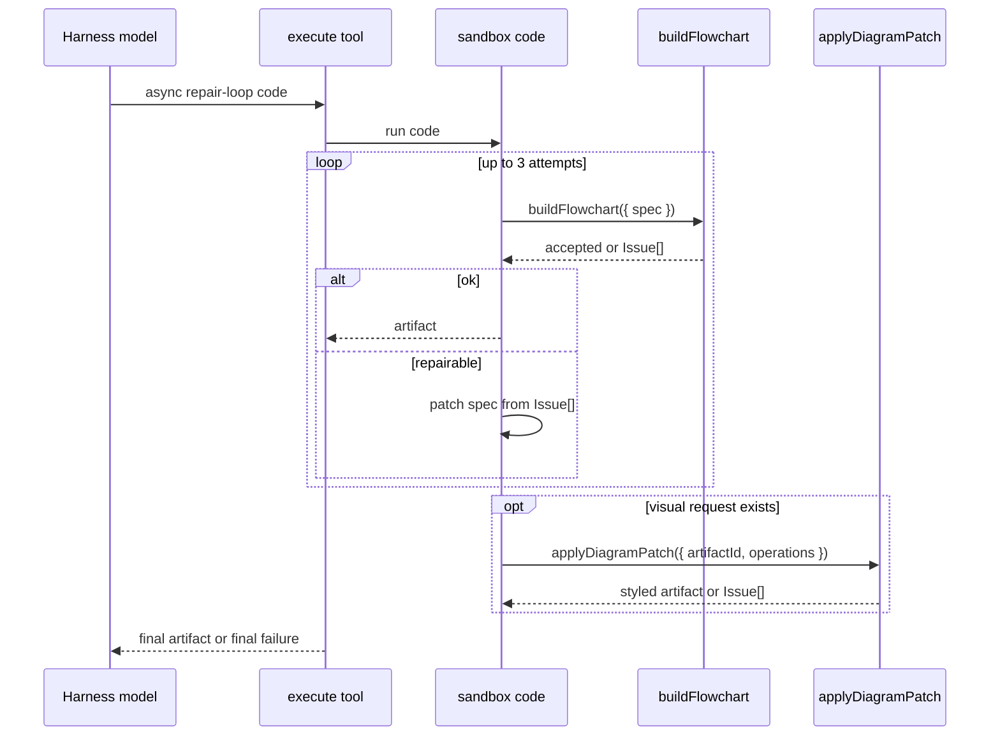

Example sandbox code:

```js
async () => {
  let spec = {
    title: "Incident triage flow",
    nodes: [
      { id: "report", label: "Report received", kind: "start" },
      { id: "severity", label: "Severity high?", kind: "decision" },
      { id: "page", label: "Page responder", kind: "end" },
      { id: "queue", label: "Queue for review", kind: "end" },
    ],
    edges: [
      { source: "report", target: "severity" },
      { source: "severity", target: "page", label: "yes" },
      { source: "severity", target: "queue", label: "no" },
    ],
    layout: { direction: "TB" },
  };

  for (let attempt = 0; attempt < 3; attempt += 1) {
    const result = await sketchi.buildFlowchart({ spec });
    if (result.ok) {
      return result.artifact;
    }

    // Real agents should patch from result.issues. This tiny fallback shows
    // the intended control flow without making the example its own repair engine.
    const missingLabels = result.issues.filter(
      (issue) => issue.code === "unlabeled_decision_branch",
    );
    if (missingLabels.length === 0) {
      return result;
    }
  }

  return { ok: false, error: "Unable to produce an accepted flowchart." };
};
```

## Implementation Shape

The Worker can implement the host APIs as route handlers, in-process service
functions, or both. The contract stays the same.

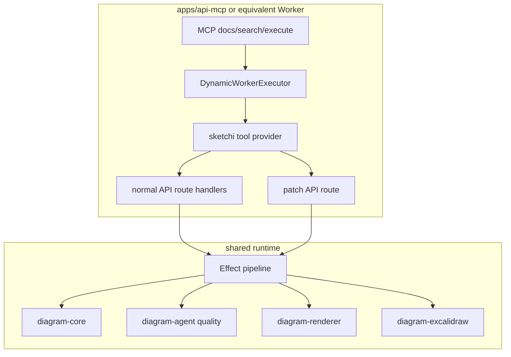

Recommended first slice:

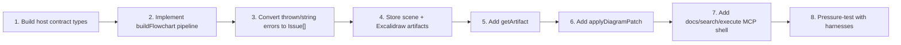

## Non-Goals

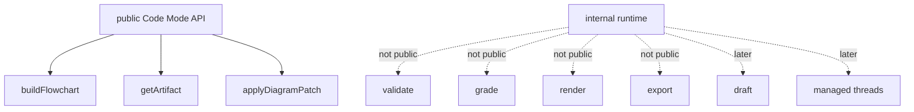

Out of scope for this document:

- Managed thread APIs.
- Convex run or artifact history.
- User artifact library.
- Auth policy details beyond "host-owned".
- Hosted PNG rendering details.
- Free-prompt drafting.
- OpenAPI search/execute over a large generated spec.
- Direct public tools for validation, grading, rendering, or export.
- Agent-facing raw Excalidraw editing as the primary mutation contract.
- Structural patch operations that add or delete nodes and edges.

## References

- [MCP-first generation scope](mcp-first-generation.md)
- [Agentic generation architecture](agentic-generation.md)
- [System architecture](architecture.md)
- Cloudflare Code Mode documentation:
  <https://developers.cloudflare.com/agents/model-context-protocol/protocol/codemode/>
- Worker Loader documentation:
  <https://developers.cloudflare.com/workers/runtime-apis/bindings/worker-loader/>
