# Sketchi Code Mode API Contract

This is the implementation spec for the first Sketchi agent-facing API surface.
It replaces the earlier "MCP tool catalog" framing with a narrower boundary:
Sketchi exposes a small MCP server for external agent harnesses, and the Code
Mode sandbox calls curated host APIs. The host APIs are normal Worker APIs backed
by the shared diagram packages.

The goal is not to make every internal function callable. The goal is to let
Claude Code, Codex, OpenCode, and similar harnesses build a correct flowchart
artifact through one clear contract, get structured repair feedback when they
are wrong, and retrieve the finished artifact.

## Decisions

- Use Code Mode for agent orchestration.
- Do not model the diagram runtime as a set of granular MCP tools.
- Do not expose `validate`, `grade`, `render`, or `export` as public operations.
- Use normal host APIs as the source of truth for request and response shapes.
- Register curated Code Mode functions over those host APIs.
- Start with `buildFlowchart` and `getArtifact`.
- Keep `draft` and managed threads out of this slice.
- Keep Effect, storage, auth, rendering, and model credentials host-side.

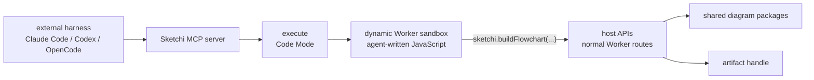

## Boundary

Sketchi has three layers. Only the top layer is MCP. The middle layer is Code
Mode. The bottom layer is the product API/runtime.

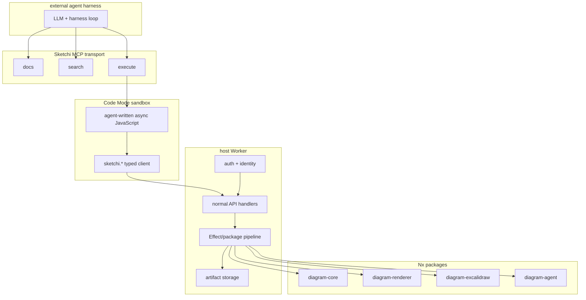

The sandbox is not trusted with secrets, tokens, storage bindings, model
credentials, or direct network access. It receives typed functions only.

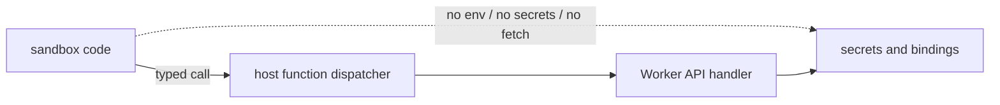

## Public MCP Surface

The external MCP server should stay small. The names below are MCP tools from
the harness point of view, not diagram runtime functions.

| MCP tool  | Purpose                                                           | Calls diagram runtime? |
| --------- | ----------------------------------------------------------------- | ---------------------- |
| `docs`    | Return the curated API contract, examples, and current non-goals. | No                     |
| `search`  | Search operation docs, issue codes, examples, and schema notes.   | No                     |
| `execute` | Run Code Mode JavaScript with the `sketchi.*` client injected.    | Yes                    |

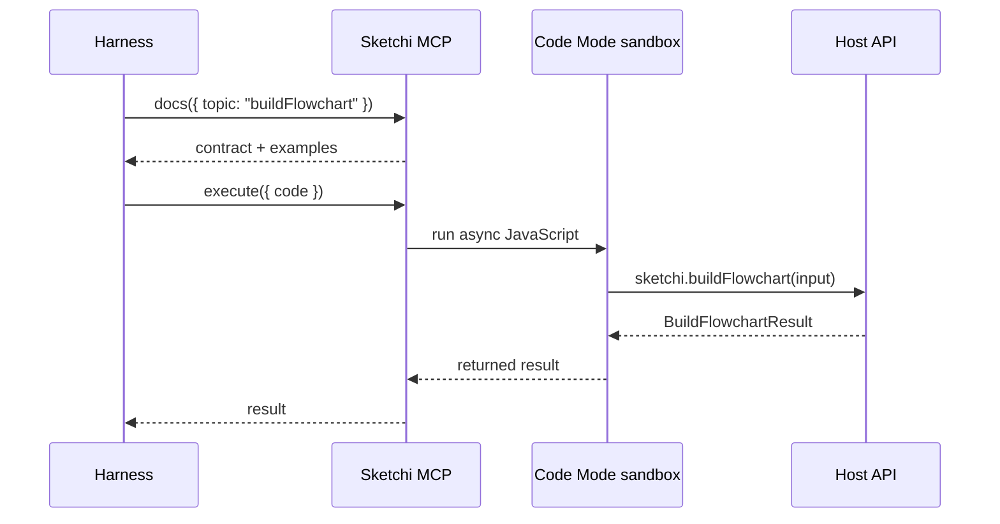

### `docs`

```ts
interface DocsRequest {
  topic?:
    | "overview"
    | "execute"
    | "buildFlowchart"
    | "getArtifact"
    | "issues"
    | "examples";
}

interface DocsResult {
  topic: string;
  content: string;
  examples: CodeExample[];
  version: string;
}

interface CodeExample {
  title: string;
  language: "ts" | "js" | "json";
  code: string;
}
```

### `search`

```ts
interface SearchRequest {
  query: string;
  limit?: number;
}

interface SearchResult {
  query: string;
  results: SearchHit[];
}

interface SearchHit {
  id: string;
  kind: "operation" | "schema" | "issue" | "example" | "non_goal";
  title: string;
  snippet: string;
  score: number;
}
```

### `execute`

The `execute` tool runs an async JavaScript arrow function in Code Mode. The
tool description must include the current `sketchi.*` TypeScript declarations
and one flowchart repair-loop example.

```ts
interface ExecuteRequest {
  code: string;
}

type ExecuteResult =
  | {
      ok: true;
      result: unknown;
      logs: string[];
    }
  | {
      ok: false;
      error: string;
      logs: string[];
    };
```

Inside `execute`, the sandbox receives this namespace:

```ts
declare const sketchi: {
  buildFlowchart(input: BuildFlowchartRequest): Promise<BuildFlowchartResult>;
  getArtifact(input: GetArtifactRequest): Promise<GetArtifactResult>;
};
```

The sandbox must not receive low-level API keys, tokens, bindings, or raw
storage handles.

## Host API Surface

These are normal host API operations. Code Mode functions call them through the
host dispatcher. A future HTTP adapter can expose the same contracts directly.

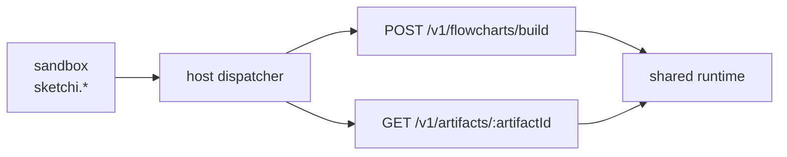

| Host operation                  | Code Mode function              | Public now?           |
| ------------------------------- | ------------------------------- | --------------------- |
| `POST /v1/flowcharts/build`     | `sketchi.buildFlowchart(input)` | Yes                   |
| `GET /v1/artifacts/:artifactId` | `sketchi.getArtifact(input)`    | Yes                   |
| validate IR                     | none                            | No, internal to build |
| grade quality                   | none                            | No, internal to build |
| render scene                    | none                            | No, internal to build |
| export Excalidraw               | none                            | No, internal to build |
| draft from prompt               | none                            | No, later             |
| managed thread                  | none                            | No, later             |

## `buildFlowchart`

`buildFlowchart` is the first real product operation. It accepts a creation
friendly flowchart spec, validates it, grades it, renders it, exports it to
Excalidraw, stores requested artifacts, and returns either an accepted artifact
or structured repair feedback.

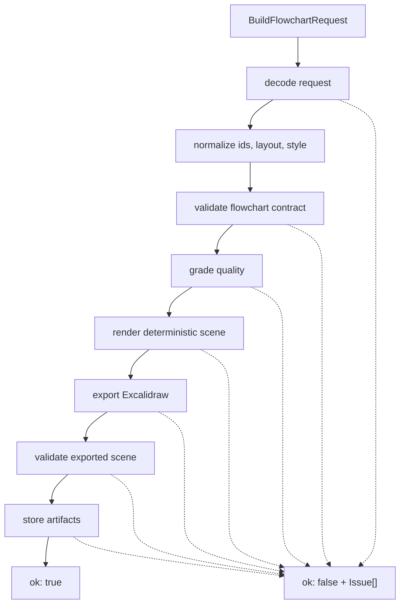

### Request

```ts
interface BuildFlowchartRequest {
  requestId?: string;
  spec: FlowchartSpec;
  options?: BuildFlowchartOptions;
}

interface BuildFlowchartOptions {
  artifactFormats?: ArtifactFormat[];
  inlineArtifacts?: InlineArtifactFormat[];
  minQualityScore?: number;
}

type ArtifactFormat = "excalidraw" | "scene" | "png";
type InlineArtifactFormat = "excalidraw" | "scene";
```

Defaults:

```json
{
  "artifactFormats": ["excalidraw", "scene"],
  "inlineArtifacts": ["excalidraw"],
  "minQualityScore": 8
}
```

### Flowchart Spec

The public input is not the full internal IR. It is the smallest shape agents
need to author correctly.

```ts
interface FlowchartSpec {
  id?: string;
  title: string;
  nodes: FlowchartNode[];
  edges: FlowchartEdge[];
  layout?: FlowchartLayout;
  style?: FlowchartStyle;
}

interface FlowchartNode {
  id: string;
  label: string;
  kind: "start" | "process" | "decision" | "end";
  description?: string;
}

interface FlowchartEdge {
  id?: string;
  source: string;
  target: string;
  label?: string;
}

interface FlowchartLayout {
  direction?: "TB" | "LR";
}

interface FlowchartStyle {
  accentColor?: HexColor;
  backgroundColor?: HexColor;
}

type HexColor = `#${string}`;
```

### Required Flowchart Invariants

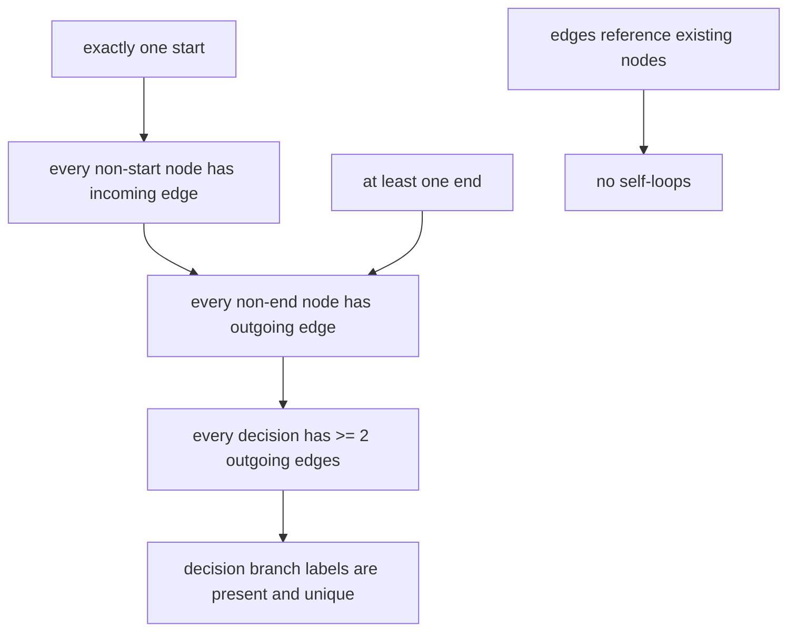

Rules:

- Node ids must be unique.
- Edge ids, when supplied, must be unique.
- Every edge source and target must match a node id.
- Edges cannot connect a node to itself.
- A flowchart must have exactly one `start` node.
- A flowchart must have at least one `end` node.
- The `start` node cannot have incoming edges.
- Every non-start node must be reachable from another node.
- Every `end` node must have zero outgoing edges.
- Every non-end node must have at least one outgoing edge.
- Every `decision` node must have at least two outgoing edges.
- Every outgoing decision branch must have a non-empty label.
- Decision branch labels from the same decision must be unique.

### Result

```ts
type BuildFlowchartResult = BuildFlowchartSuccess | BuildFlowchartFailure;

interface BuildFlowchartSuccess {
  ok: true;
  status: "accepted";
  buildId: string;
  requestId?: string;
  normalizedSpec: NormalizedFlowchartSpec;
  quality: QualityReport;
  artifact: ArtifactBundle;
  issues: Issue[];
}

interface BuildFlowchartFailure {
  ok: false;
  status:
    | "invalid_input"
    | "invalid_flowchart"
    | "quality_failed"
    | "render_failed"
    | "export_failed"
    | "storage_failed";
  buildId?: string;
  requestId?: string;
  normalizedSpec?: NormalizedFlowchartSpec;
  quality?: QualityReport;
  partial?: PartialArtifactBundle;
  issues: Issue[];
}

type NormalizedFlowchartSpec = Required<
  Pick<FlowchartSpec, "id" | "title" | "nodes" | "edges" | "layout" | "style">
>;
```

`issues` is empty when the build is accepted and there are no warnings. Warnings
may still be present on accepted builds.

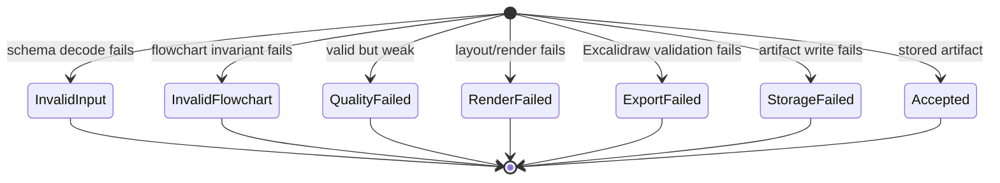

### Quality Report

```ts
interface QualityReport {
  accepted: boolean;
  score: number;
  threshold: number;
  summary: {
    nodeCount: number;
    edgeCount: number;
  };
  checks: QualityCheck[];
}

interface QualityCheck {
  code: string;
  passed: boolean;
  severity: "error" | "warning";
  message: string;
  refs: IssueRef[];
}
```

## Issue Contract

Issues are the main repair interface. They must be stable, machine-readable, and
good enough for an agent to patch its spec without guessing.

```ts
interface Issue {
  code: IssueCode;
  severity: "error" | "warning";
  stage: "input" | "flowchart" | "quality" | "render" | "export" | "storage";
  ref?: IssueRef;
  message: string;
  hint: string;
}

interface IssueRef {
  kind: "request" | "diagram" | "node" | "edge" | "artifact";
  id?: string;
  path?: string;
}
```

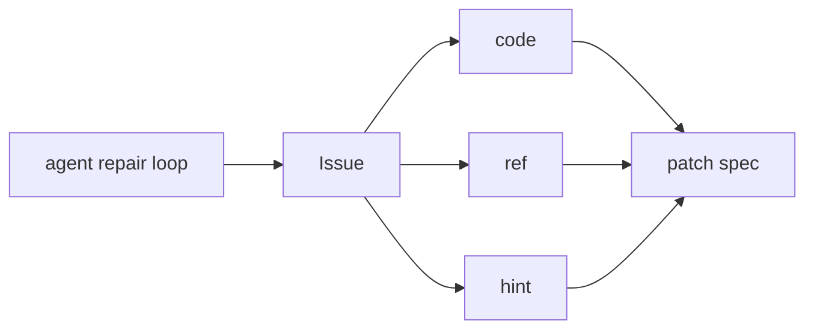

Initial issue codes:

```ts
type IssueCode =
  | "missing_field"
  | "invalid_type"
  | "invalid_enum"
  | "invalid_color"
  | "duplicate_node_id"
  | "duplicate_edge_id"
  | "missing_edge_source"
  | "missing_edge_target"
  | "self_loop"
  | "missing_start"
  | "multiple_starts"
  | "missing_end"
  | "start_has_incoming"
  | "end_has_outgoing"
  | "unreachable_node"
  | "missing_outgoing_edge"
  | "underbranched_decision"
  | "unlabeled_decision_branch"
  | "duplicate_decision_branch_label"
  | "disconnected_graph"
  | "generic_label"
  | "label_too_long"
  | "quality_below_threshold"
  | "render_failed"
  | "text_overflow"
  | "arrow_binding_invalid"
  | "arrow_overlap"
  | "export_invalid_scene"
  | "storage_write_failed";
```

Example:

```json
{
  "code": "unlabeled_decision_branch",
  "severity": "error",
  "stage": "flowchart",
  "ref": {
    "kind": "edge",
    "id": "risk-review-to-approve",
    "path": "spec.edges[4].label"
  },
  "message": "Decision node \"risk-review\" has an outgoing branch without a label.",
  "hint": "Add a short branch label such as \"approved\" or \"rejected\"."
}
```

## Artifact Contract

`buildFlowchart` stores artifacts only after the flowchart is accepted and the
requested formats are generated successfully.

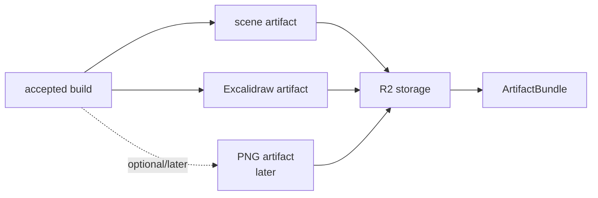

```ts
interface ArtifactBundle {
  artifactId: string;
  diagramId: string;
  formats: ArtifactFormatRef[];
  preview?: ArtifactFormatRef;
}

interface PartialArtifactBundle {
  artifactId?: string;
  diagramId?: string;
  formats?: ArtifactFormatRef[];
}

interface ArtifactFormatRef {
  format: ArtifactFormat;
  mimeType: string;
  url?: string;
  expiresAt?: string;
  inline?: unknown;
  sizeBytes?: number;
}
```

The first implementation should support:

- `scene`: rendered deterministic scene JSON.
- `excalidraw`: portable Excalidraw scene JSON.

`png` is allowed in the contract for forward compatibility, but it should not be
advertised as available until the hosted render proof adapter exists.

## `getArtifact`

`getArtifact` retrieves a stored artifact format by `artifactId`. `diagramId`
is semantic and not unique enough for retrieval.

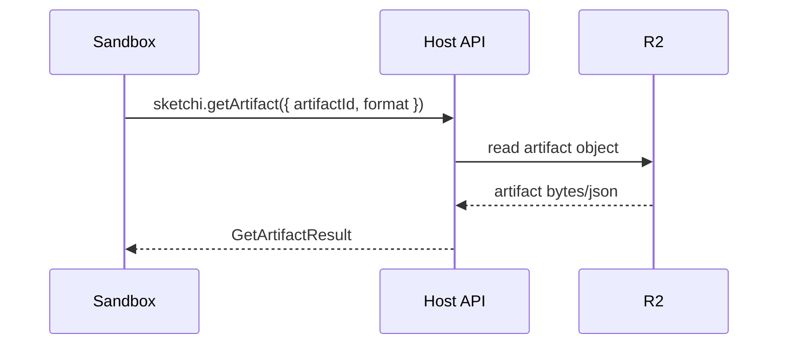

```ts
interface GetArtifactRequest {
  artifactId: string;
  format?: ArtifactFormat;
  inline?: boolean;
}

type GetArtifactResult = GetArtifactSuccess | GetArtifactFailure;

interface GetArtifactSuccess {
  ok: true;
  artifactId: string;
  diagramId: string;
  format: ArtifactFormat;
  mimeType: string;
  url?: string;
  expiresAt?: string;
  inline?: unknown;
  sizeBytes?: number;
}

interface GetArtifactFailure {
  ok: false;
  status: "not_found" | "format_unavailable" | "expired" | "storage_failed";
  issues: Issue[];
}
```

## Expected Agent Loop

The harness should write a spec, call `buildFlowchart`, inspect structured
issues, patch the spec, and stop when `ok` is true.

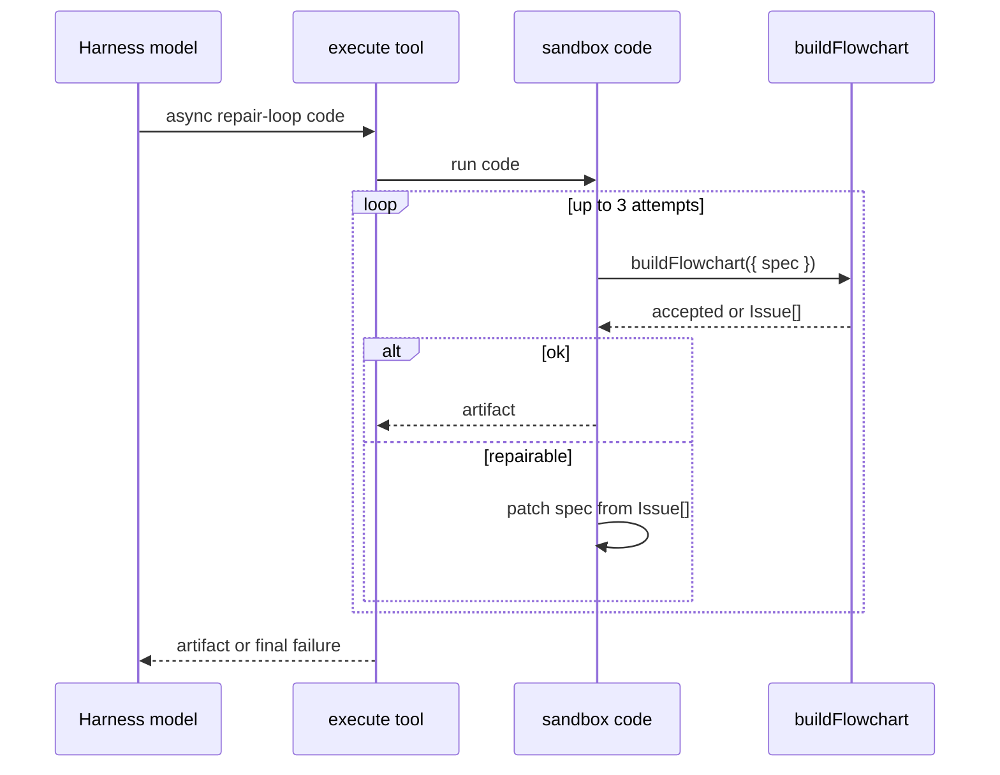

Example sandbox code:

```js
async () => {
  let spec = {
    title: "Incident triage flow",
    nodes: [
      { id: "report", label: "Report received", kind: "start" },
      { id: "severity", label: "Severity high?", kind: "decision" },
      { id: "page", label: "Page responder", kind: "end" },
      { id: "queue", label: "Queue for review", kind: "end" },
    ],
    edges: [
      { source: "report", target: "severity" },
      { source: "severity", target: "page", label: "yes" },
      { source: "severity", target: "queue", label: "no" },
    ],
    layout: { direction: "TB" },
  };

  for (let attempt = 0; attempt < 3; attempt += 1) {
    const result = await sketchi.buildFlowchart({ spec });
    if (result.ok) {
      return result.artifact;
    }

    // Real agents should patch from result.issues. This tiny fallback shows
    // the intended control flow without making the example its own repair engine.
    const missingLabels = result.issues.filter(
      (issue) => issue.code === "unlabeled_decision_branch",
    );
    if (missingLabels.length === 0) {
      return result;
    }
  }

  return { ok: false, error: "Unable to produce an accepted flowchart." };
};
```

## Implementation Shape

The Worker can implement the host APIs as route handlers, in-process service
functions, or both. The contract stays the same.

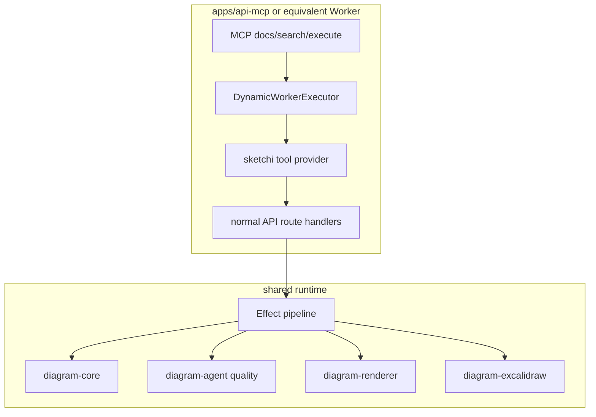

Recommended first slice:

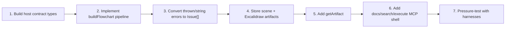

## Non-Goals

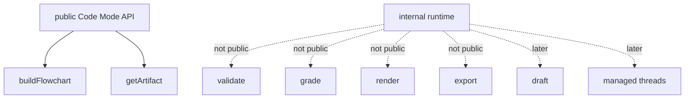

Out of scope for this document:

- Managed thread APIs.
- Convex run or artifact history.
- User artifact library.
- Auth policy details beyond "host-owned".
- Hosted PNG rendering details.
- Free-prompt drafting.
- OpenAPI search/execute over a large generated spec.
- Direct public tools for validation, grading, rendering, or export.

## References

- [MCP-first generation scope](mcp-first-generation.md)
- [Agentic generation architecture](agentic-generation.md)
- [System architecture](architecture.md)
- Cloudflare Code Mode documentation:
  <https://developers.cloudflare.com/agents/model-context-protocol/protocol/codemode/>
- Worker Loader documentation:
  <https://developers.cloudflare.com/workers/runtime-apis/bindings/worker-loader/>
