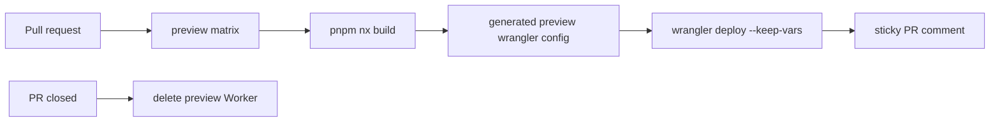

# App Preview Deploys

## Current Matrix

| App          | Preview Worker                   | Production Worker    | Domain attach                    |
| ------------ | -------------------------------- | -------------------- | -------------------------------- |
| `playground` | `sketchi-playground-pr-<number>` | `sketchi-playground` | `playground.sketchi.app`         |
| `studio`     | `sketchi-studio-pr-<number>`     | `sketchi-studio`     | `studio.sketchi.app`             |
| `web`        | `sketchi-web-pr-<number>`        | `sketchi-web`        | `sketchi.app`, `www.sketchi.app` |
| `excalidraw` | `sketchi-excalidraw-pr-<number>` | `sketchi-excalidraw` | `excalidraw.sketchi.app`         |
| `icons`      | `sketchi-icons-pr-<number>`      | `sketchi-icons`      | `icons.sketchi.app`              |



## Preview Workflow

Pull requests to `main` deploy matrix apps to PR-specific Cloudflare Workers.

- uses the same pnpm 11.5.0, Node 24, `pnpm install --frozen-lockfile` setup as
  `v2-ci`;
- builds each Nx app in an isolated matrix job;
- writes a generated `dist/server/wrangler.<app>.preview.json` with the preview
  Worker name and no custom production routes;
- runs `wrangler deploy --keep-vars`;
- writes or updates one sticky PR comment per app with the preview URL.

## Required Configuration

- `CHROMATIC_PROJECT_TOKEN`: `staging` environment secret for Storybook
  publish and visual checks.
- `CLOUDFLARE_ACCOUNT_ID`: `staging` environment variable or secret.
- `CLOUDFLARE_API_TOKEN`: `staging` environment secret with Workers
  edit/deploy access.

| Source                                  | Target                          | Purpose                   |
| --------------------------------------- | ------------------------------- | ------------------------- |
| Infisical `sketchi` `/github` `staging` | GitHub `staging` environment    | CI and PR preview deploys |
| Infisical `sketchi` `/github` `prod`    | GitHub `production` environment | production deploys        |

The canonical source for those GitHub Actions values is the Infisical `sketchi`
project under `/github`, synced to GitHub environment secrets:

- `staging`: GitHub `staging` environment for CI and PR preview deploys.
- `prod`: GitHub `production` environment for production deploys.

Do not sync both Infisical environments into the same repository-secret
namespace; environment-scoped GitHub secrets keep preview and production values
from overwriting each other when the values eventually diverge.

Cloudflare documents that non-interactive CI deploys require an API token and
account ID. The token should stay in GitHub Secrets, not in source control.

## Cleanup

Cleanup runs automatically when a PR closes and deletes the PR-specific Worker.
Manual cleanup is also available:

```sh
CLOUDFLARE_ACCOUNT_ID=... CLOUDFLARE_API_TOKEN=... \
  node scripts/04-delete-preview-worker.mjs --pr-number 123
```

## Operational Scripts

The deploy command scripts are numbered because they are operational steps:

- `scripts/01-prepare-preview-deploy.mjs`
- `scripts/02-extract-preview-url.mjs`
- `scripts/03-upsert-preview-comment.mjs`
- `scripts/04-delete-preview-worker.mjs`
- `scripts/05-prepare-production-domain-deploy.mjs`

Pass `--app playground`, `--app studio`, `--app web`, `--app excalidraw`, or
`--app icons` to the prepare and cleanup scripts when running them manually.

## Production Worker Deploys

The `app-production-deploy` workflow runs on pushes to `main` and deploys the
five wired production Workers without assigning final custom domains.

Those deploys keep `workers_dev` enabled so the app can be verified from
Cloudflare-owned `workers.dev` URLs before any DNS or registrar cutover.

Assigning `sketchi.app`, `www.sketchi.app`, `playground.sketchi.app`,
`studio.sketchi.app`, `excalidraw.sketchi.app`, and `icons.sketchi.app` is
intentionally manual. Run the `app-production-deploy` workflow with
`attach_domains` enabled only when the new site is ready to own those hostnames.
The manual step writes a generated domain Wrangler config from
`scripts/05-prepare-production-domain-deploy.mjs` and deploys that route-bearing
config.
