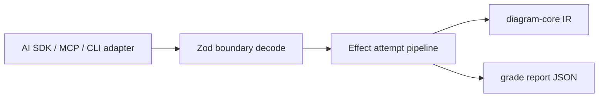

# diagram-agent

Graded `create_diagram` runtime: the tool contract, normalization, grading,
and per-turn repair policy that the studio spike used to own inline.



| Owns                                          | Does not own                 |
| --------------------------------------------- | ---------------------------- |
| `create_diagram` name, description, Zod input | model calls and streaming    |
| tool-arg cleanup and IR normalization         | provider/gateway wiring      |
| deterministic grading and accept threshold    | chat threads and persistence |
| attempt limits and revision-of-prior tracking | app routes and auth          |
| typed attempt errors (Effect)                 | rendering and export         |

## Commands

```sh
pnpm nx test diagram-agent
pnpm nx typecheck diagram-agent
pnpm nx build diagram-agent
```

## Shape

Transport boundaries stay Zod (`DiagramToolInputSchema` plugs straight into
AI SDK tools and future MCP catalogs). Inside, `evaluateDiagramAttempt` is an
Effect pipeline with tagged failures (`DiagramToolInputError`,
`DiagramStructureError`), and `createDiagramToolSession` adapts it back to
plain JSON outcomes whose `report` field is exactly what the model sees.

Draft/revise orchestration with direct model calls lands here next, per
[docs/mcp-first-generation.md](../../docs/mcp-first-generation.md).
