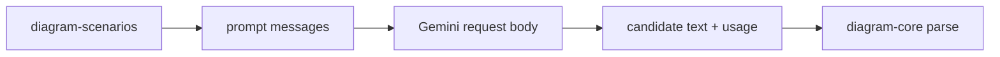

# diagram-generation

Model-facing generation helpers for Sketchi diagram candidates.



| Owns                                       | Does not own                  |
| ------------------------------------------ | ----------------------------- |
| prompt message mapping                     | chat threads                  |
| Gemini REST body mapping                   | artifact persistence          |
| Cloudflare AI Gateway client compatibility | UI streaming                  |
| candidate parsing and diagnostics          | final grading/revision policy |

## Commands

```sh
pnpm nx test diagram-generation
pnpm nx typecheck diagram-generation
pnpm nx build diagram-generation
```

## Direction

This package is the likely first home for Effect-backed schemas and typed
generation errors. Keep the route handlers plain: Convex, Workers, MCP, and app
routes should call this package or the planned `diagram-agent` package instead
of owning generation logic themselves.
